# Diabetes AI/ML Digital Twin Framework

### 📌 Author: **Zarrin Monirzadeh**  
Data Engineer | Software Engineer | AI/ML in the Systems | Causal Modeling


An AI/ML-driven digital twin framework for diabetes that integrates machine learning, temporal modeling, and causal inference to enable decision-aware healthcare systems.

---

## 🧠 Overview

This repository presents a **reproducible digital twin architecture** for modeling glucose dynamics in diabetes patients using Continuous Glucose Monitoring (CGM) data.

Unlike traditional predictive models, this framework enables:

- Simulation of interventions (diet, activity)
- Counterfactual outcome estimation
- Temporal glucose modeling
- Decision-support insights grounded in AI and causal inference

This work bridges the gap between predictive machine learning and actionable clinical decision systems.
---
## 🎯 Why This Matters

Traditional AI models in healthcare focus on prediction.

This framework goes further by enabling:
- Simulation of treatment scenarios
- Causal reasoning about interventions
- Decision-aware modeling rather than passive forecasting

This shift is critical for building real-world clinical AI systems.
---

## ⚙️ Methodology

### 🔹 Machine Learning (AI Core)
- Regression-based prediction
- Classification of glucose states
- Neural networks (MLP)

### 🔹 Time-Series Modeling
- CGM trajectory representation
- Temporal dynamics capture

### 🔹 Causal Inference
- Counterfactual reasoning
- Difference-in-Differences (DiD)

### 🔹 Simulation Engine
- Intervention-based trajectory generation
- Scenario comparison

---

## 📄 Paper

📄 [View Preview](paper/PreviewPaper.pdf)

Full version available upon request:

📧 **monirzadehzarrin@gmail.com**

---
## 🏗️ System Architecture

The digital twin framework is designed as a modular pipeline:

1. Data Ingestion
   - XML → parsed CGM streams
   - CSV → structured datasets

2. Feature Engineering
   - Temporal features (lags, rolling stats)
   - Physiological constraints

3. Modeling Layer
   - Regression models (baseline)
   - ML models (scikit-learn / MLP)

4. Simulation Engine
   - Counterfactual trajectory generation
   - Intervention modeling (diet, activity)

5. Evaluation Layer
   - RMSE / MAE
   - Clinical metrics (time-in-range)

6. Visualization
   - CGM plots
   - Counterfactual comparisons
  
---
## ⚡ Engineering Highlights

- Built end-to-end ML pipeline from raw XML clinical data
- Designed reproducible data processing for multi-patient CGM streams
- Implemented counterfactual simulation engine for intervention analysis
- Structured modular pipeline (train/test separation)
- Generated interpretable outputs for clinical decision support

---

## 🧪 Reproducibility & Design

- Fully reproducible pipeline from raw XML to model outputs
- Modular architecture supporting extension and experimentation
- Clear separation between training and evaluation workflows
  
---
## 🧪 Data Pipeline

Raw CGM XML → Structured CSV → Feature Engineering → AI Modeling → Counterfactual Simulation

- XML samples: `code/sample_raw_xml/`
- CSV outputs: `code/sample_raw_csv/`
- Pipelines:
  - `train_pipeline.ipynb`
  - `test_pipeline.ipynb`

---

## 📊 Sample Outputs

### 🔹 Regression Results

| Model | MAE | RMSE | R2 |
|------|-----|------|----|
| Linear Regression | 43.2 | 54.1 | 0.45 |
| Random Forest | 35.8 | 47.2 | 0.62 |
| Gradient Boosting | 33.1 | 44.9 | 0.68 |
| MLP | 30.5 | 41.7 | 0.72 |

📂 Full file: [regression_results.csv](code/regression_results.csv)

---

### 🔹 Classification Results

| Model | Accuracy | AUC |
|------|----------|-----|
| Logistic Regression | 0.78 | 0.84 |
| Random Forest | 0.85 | 0.91 |
| Gradient Boosting | 0.87 | 0.93 |
| MLP | 0.89 | 0.95 |

📂 Full file: [classification_results.csv](code/classification_results.csv)

---

### 🔹 Counterfactual Summary

| Scenario | Peak Glucose | Time in Range (%) |
|----------|--------------|------------------|
| Baseline (60g carbs) | 179 | 58 |
| Reduced carbs (30g) | 153 | 72 |
| Walking intervention | 163 | 68 |

📂 Full file: [counterfactual_summary.csv](code/counterfactual_summary.csv)

---

## ▶️ How to Run

### Install dependencies

```bash
pip install pandas numpy matplotlib scikit-learn
```

### Run pipeline

```bash
python code/demo_pipeline.py
```

### Or run notebooks

- `train_pipeline.ipynb`
- `test_pipeline.ipynb`

---
## 🧩 Challenges

- Noisy CGM data and missing values
- Temporal dependency modeling
- Aligning causal inference with time-series data
- Translating ML outputs into clinically meaningful insights

---
## 📊 Results & Visualizations

### 📌 Fig 01 — Daily CGM Profile (Real Patient)
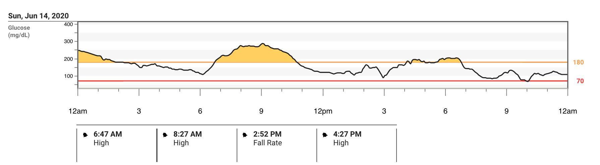

Shows real glucose fluctuations over a 24-hour period, including hyperglycemic and hypoglycemic episodes.

---

### 📌 Fig 02 — Ambulatory Glucose Profile (AGP)
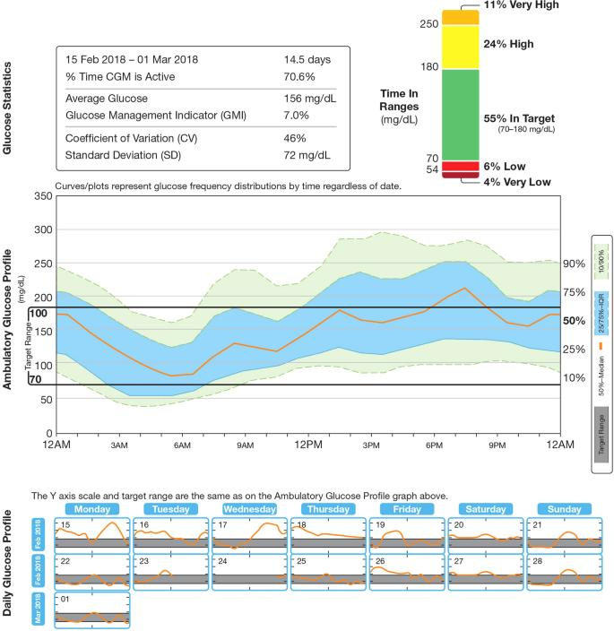

Summarizes glucose distribution, variability, and time-in-range statistics.

---

### 📌 Fig 03 — Same HbA1c, Different Glucose Dynamics
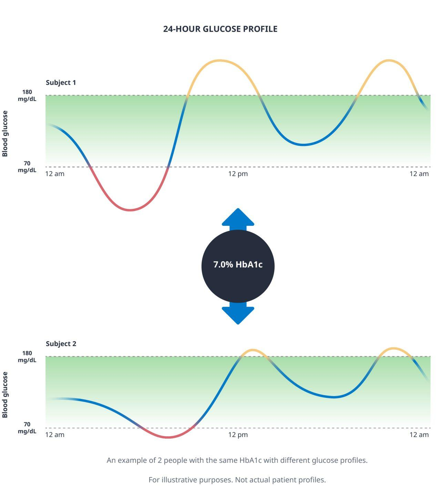

Illustrates how two patients can have identical HbA1c but very different glucose variability.

---

### 📌 Fig 04 — Glucose Threshold Monitoring
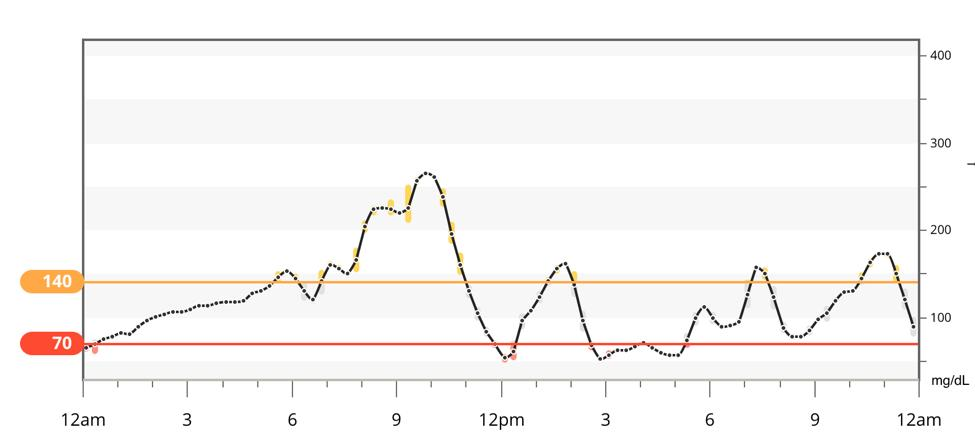

Highlights safe range boundaries (70–180 mg/dL) and excursions beyond them.

---

### 📌 Fig 05 — Smoothed CGM Signal with Trend
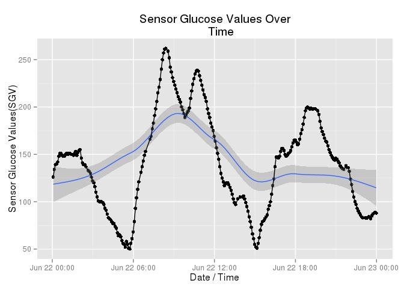

Combines raw CGM signal with trend estimation and uncertainty.

---

### 📌 Fig 06 — 24-Hour CGM Trajectory
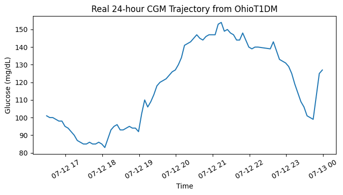

Baseline time-series used for modeling and simulation.

---

### 📌 Fig 07 — Counterfactual Glucose Simulation
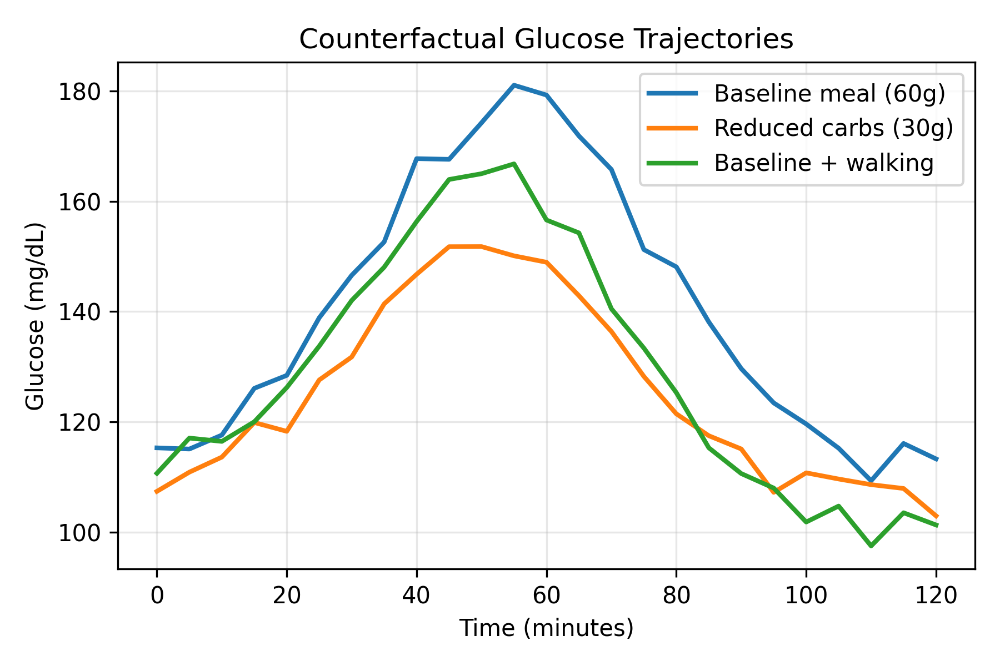

Simulates interventions:
- Reduced carbohydrates
- Walking effect

---

### 📌 Fig 08 — Real vs Counterfactual Trajectories
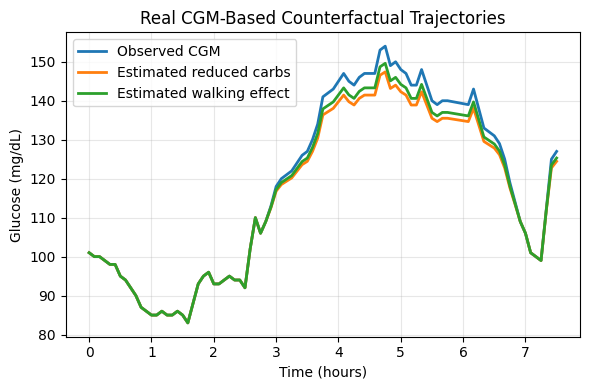

Compares observed CGM with simulated intervention outcomes.

---

### 📌 Fig 09 — Clinical Feature Sensitivity Analysis
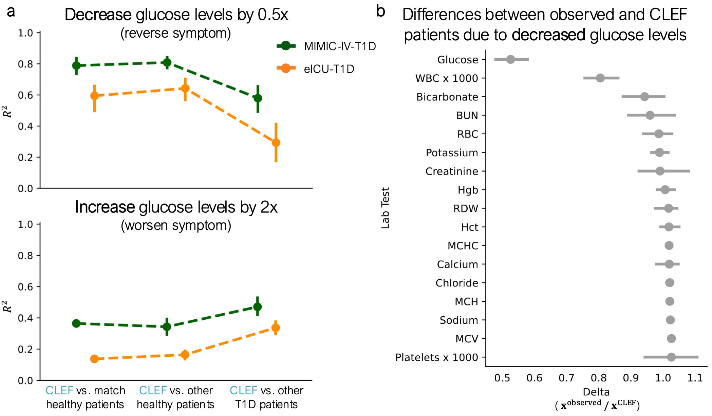

Evaluates how physiological variables respond to glucose perturbations.

---

### 📌 Fig 10 — Intervention vs Counterfactual Framework
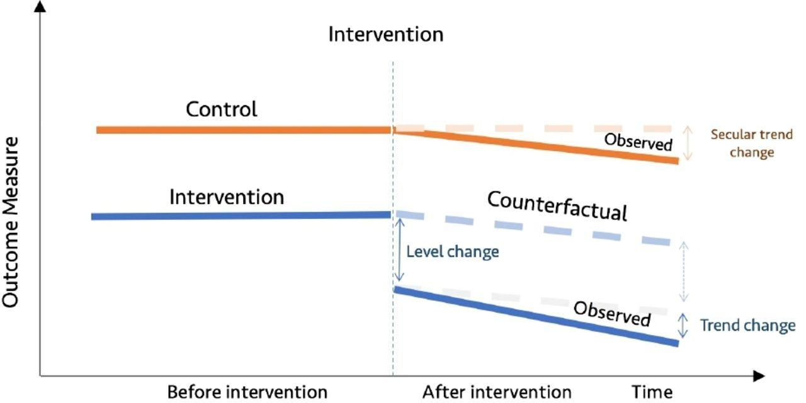

Core causal concept:
Observed vs counterfactual trajectories after intervention.

---

### 📌 Fig 11 — Difference-in-Differences (DiD)
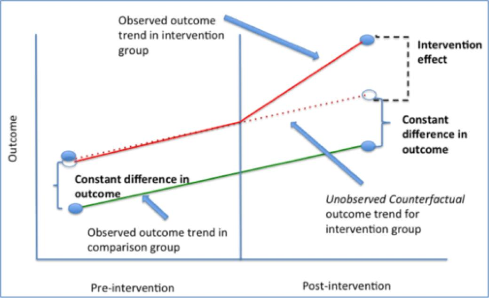

Estimates intervention effect using causal inference.

---

### 📌 Fig 12 — Activity Impact on Glucose
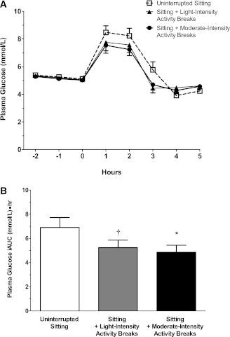

Compares:
- Sitting
- Light activity
- Moderate activity

---

### 📌 Fig 13 — Model Behavior (Classic vs Improved)
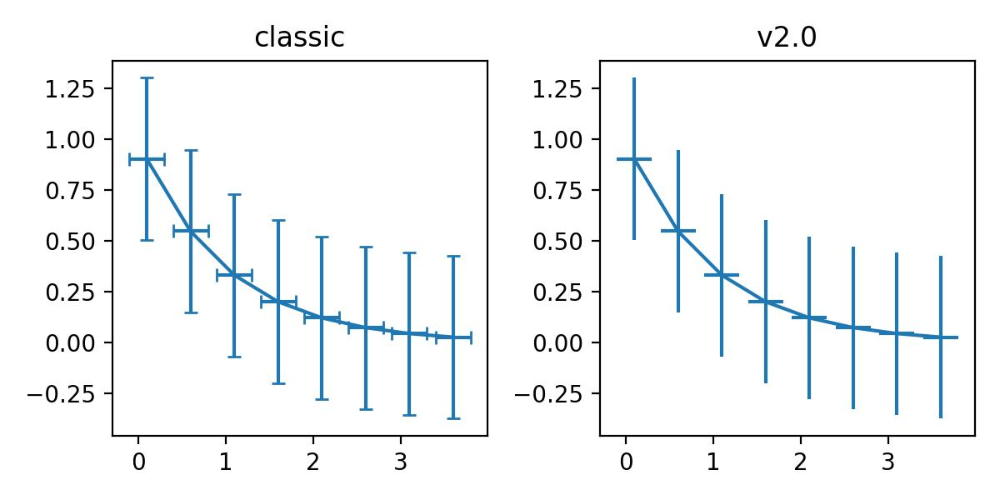

Comparison of baseline vs enhanced modeling approach.

---

### 📌 Fig 14 — Linear vs Nonlinear Trends
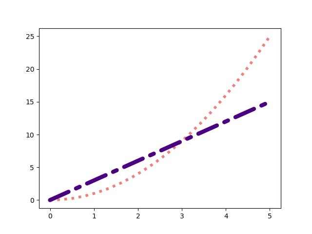

Demonstrates limitations of linear modeling in physiological systems.

---

### 📌 Fig 15 — Glucose Envelope / Range Modeling
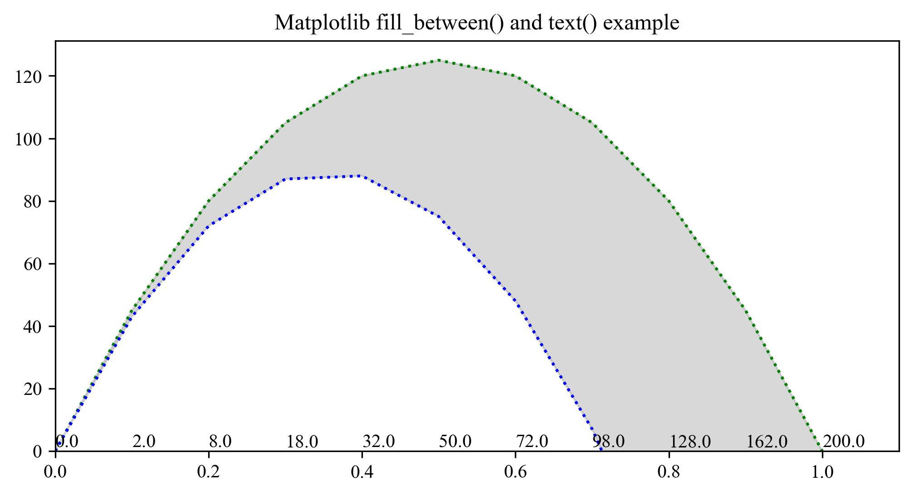

Captures uncertainty and physiological bounds.

---

### 📌 Fig 16 — Glucose Stability Zones
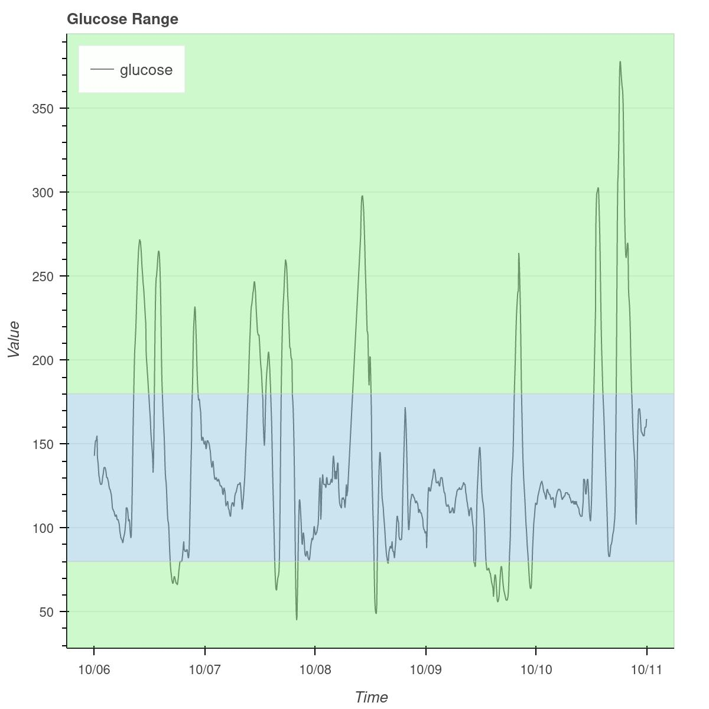

Defines:
- Hypoglycemia
- Normal range
- Hyperglycemia

---

### 📌 Fig 17 — Longitudinal CGM (OhioT1DM)
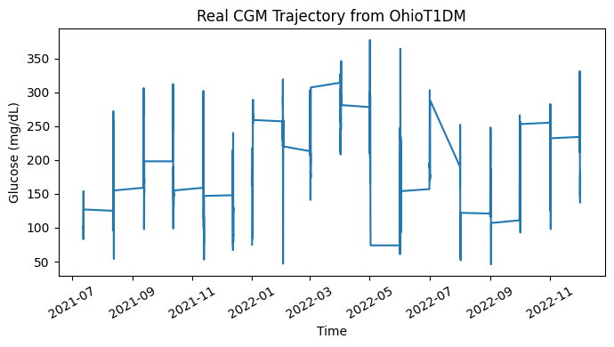

Long-term variability across months.

---

### 📌 Fig 18 — Regression Fit Example
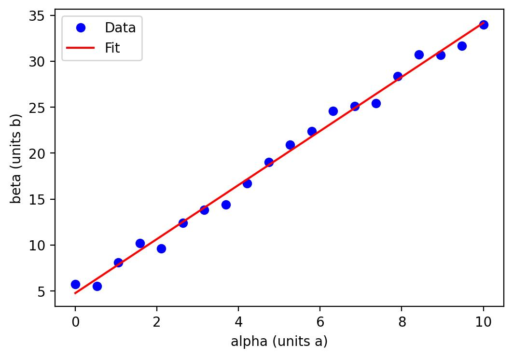

Illustrates model fitting and parameter estimation.

---

### 📌 Fig 19 — Multi-Series Trend Comparison
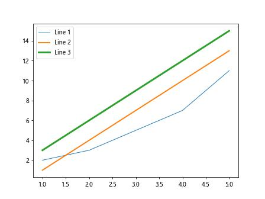

Comparison of multiple modeled trajectories.

---

## 📊 Key Insight

This framework demonstrates a transition from traditional predictive modeling toward decision-aware AI systems.

It enables:

- Patient-specific digital twin modeling
- Simulation of intervention strategies (diet, activity)
- Causal inference for treatment effect estimation
- Data-driven clinical decision support

This approach moves beyond forecasting toward actionable intelligence in healthcare systems.
---

## 💡 Key Contributions

- Patient-specific digital twin modeling  
- Simulation of treatment scenarios  
- Causal inference for intervention effects  
- Explainable AI for healthcare decision support  
- AI-driven digital twin modeling  
- Counterfactual simulation engine  
- Real-data CGM pipeline (XML → CSV)  
- Decision-support framework  

---
## 🇺🇸 National Interest Relevance

Diabetes is a major public health challenge in the United States, affecting millions and contributing significantly to healthcare costs and long-term complications.

This framework contributes to national priorities by:

- Enabling personalized, data-driven treatment simulation
- Supporting clinicians with AI-driven decision tools
- Reducing risk through predictive and preventive modeling
- Advancing digital health and precision medicine

By combining machine learning with causal inference and simulation, this work supports the development of next-generation intelligent healthcare systems.

---
## 🧪 Use Cases

- Personalized diabetes management  
- Clinical decision support systems  
- Research in causal ML for healthcare  
- Simulation-based treatment planning  

---

## 📁 Repository Structure

```
code/
├── train_pipeline.ipynb
├── test_pipeline.ipynb
├── sample_raw_xml/
├── sample_raw_csv/

figures/
├── Fig01–Fig19

paper/
├── PreviewPaper.pdf
```

---

## ⭐ Final Note

This project shifts AI from:

👉 Prediction → Decision-Aware Intelligence  

enabling real-world clinical decision support through simulation and causal reasoning.
